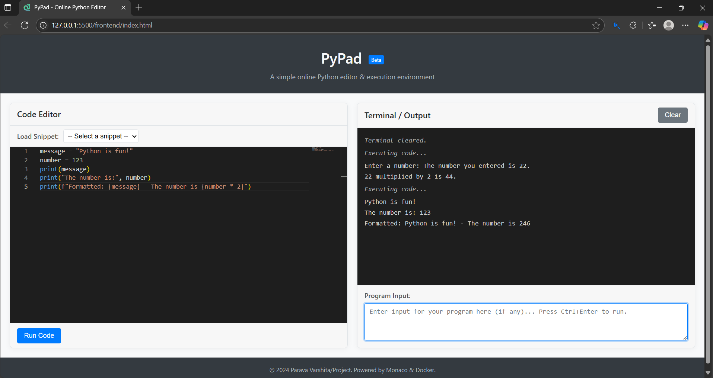
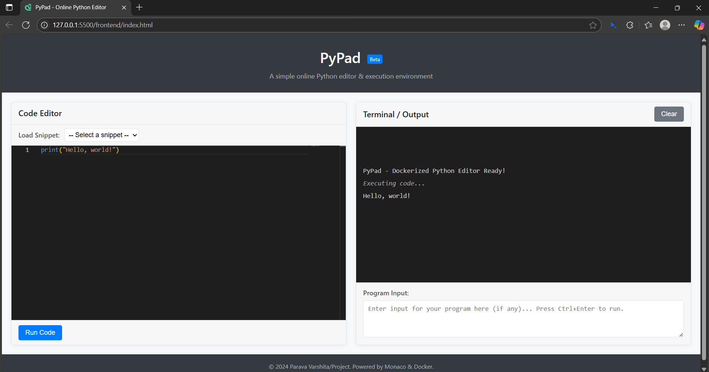

# 🐍 Online Python Code Editor

This is a web-based Python code editor that allows users to write, run, and view the output of Python code directly from the browser.

## 🚀 Features

- ✍️ Write and edit Python code in the browser
- ▶️ Run code and get real-time output
- ⚙️ Backend execution using Python (Flask)
- 💡 Simple and user-friendly interface

## 🛠️ Tech Stack

- **Frontend**: HTML, CSS, JavaScript
- **Backend**: Python (Flask)
- **Editor UI**: CodeMirror

## 📸 Screenshots

### 🧑‍💻 Code Editor UI

*(You can add more screenshots similarly if needed)*

## 📂 Project Structure

